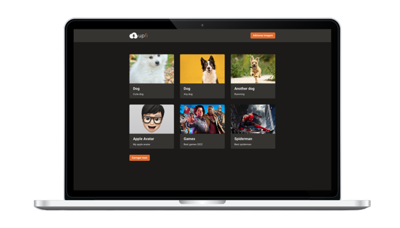

<p align="center">
  
</p>

<p align="center">
  

  

  
</p>

<div align="center">
  
</div>

<br>

## 💡 Introduction

Image upload web application
- Upload your images
- View your uploaded images
- Go to image URL origin
- Load more button (infinite query)

<br>

## 🧪 Technologies and Services

- [React](https://reactjs.org)
- [NextJS](https://nextjs.org/)
- [Fauna](https://fauna.com/)
- [imgBB](https://pt-br.imgbb.com/)


<br>

## 🖥 Pre-requisites:

- NodeJS
- Yarn

<br/>

## 🚀 How to Run it?

From project's root file:

```sh
$ yarn install
$ yarn dev
```

<br/>

## ⚙️ Environment Variables

Here are an example of how you can set up your `.env.local` file with Services Variables. Replace them with your own services values.

```js
NEXT_PUBLIC_IMGBB_API_KEY=""
FAUNA_API_KEY=""

```

<br>

## 🔖 Layout

Check Figma Layout of this project [here](https://www.figma.com/file/QKxbxCVwwlDLMrCtHae239/Desafio-2-M%C3%B3dulo-4-ReactJS/duplicate)

<br>

## 📝 License

MIT License © Yuri Paiva. Check [LICENSE](LICENSE) for more details

---

<br>

Made with 💜 &nbsp;by Yuri Paiva
